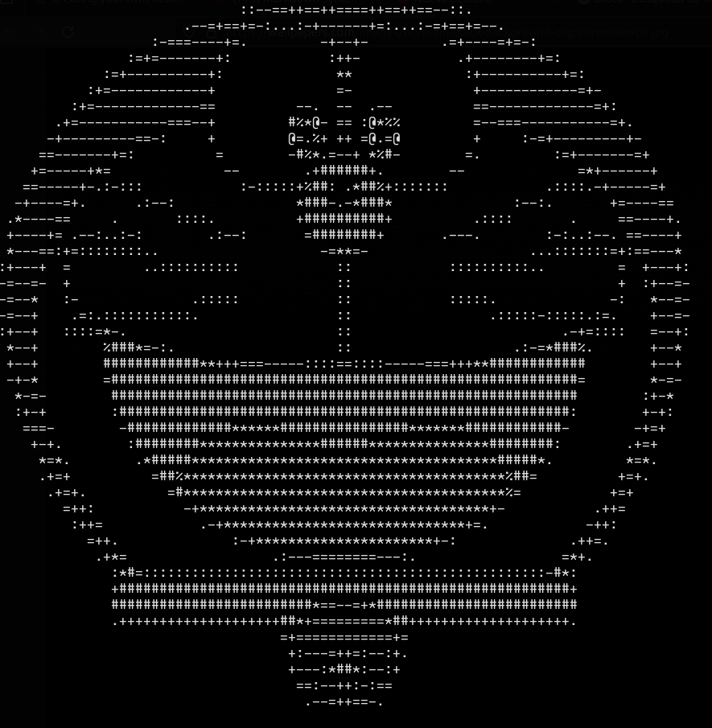

# Doraemongotchi
---

The game that every children wants for Christmas: _Doraemongotchi_

_Doraemongotchi_ is a project born to make a remake of the classic **_Tamagotchi_**

To get the _Doraemongotchi_, download this repo with ```git clone https://github.com/spm73/project_p1```

Then, do the following commands:
```shell
gcc main.c functions.c -lncurses
# this command compiles the file

./a.out
# command to run the program
```
